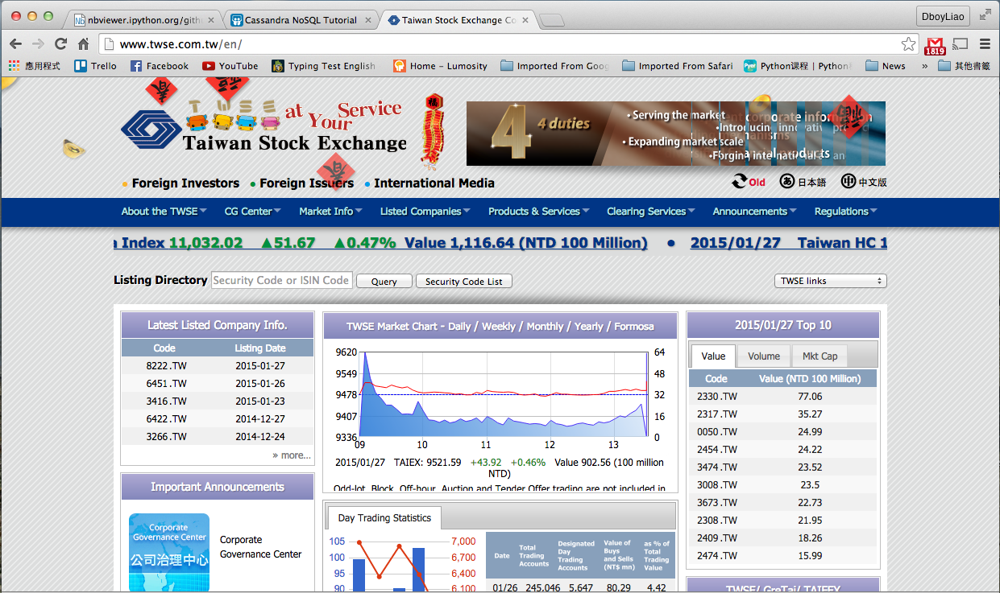
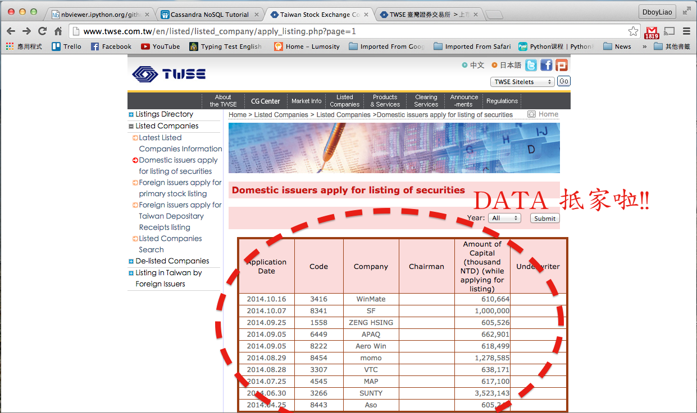
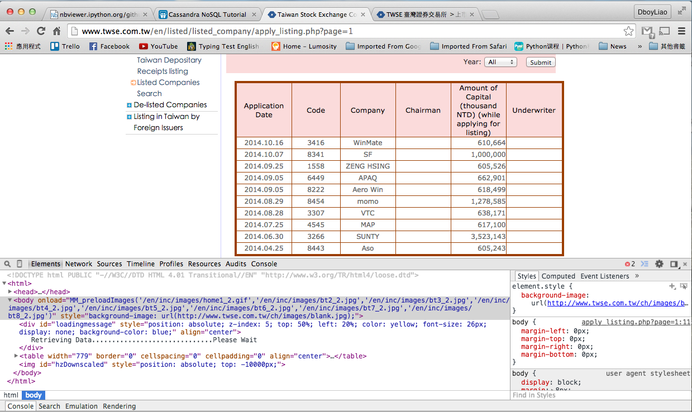

<h1>
  <font color=#005CE6>R Basic with Web Crawler</font>
</h1>
<h3>
  <font color="green">Week 1</font>
</h3>
<h3>
  <font color='wheat'>Chia-Chi Chang, Yin-Chen Liao</font>
</h3>

---

# Packages

<div align='left'>
<p>R 是個開源免費的軟體。</p>

<p>有非常多人 (駭客們) 幫它撰寫各式各樣的套件。</p>

<p>我們要去哪裡看說 R 有什麼套件呢?</p>

<p class='fragment'>主要有兩大管道:</p>
<ul>
  <li class='fragment'><a href='http://cran.r-project.org/'>CRAN</a></li>
  <li class='fragment'><a href='https://github.com/'>Github</a></li>
<ul>
<p class='fragment'>
<font size=8 color="yellow">到底我們該怎麼使用這些套件呢 =  =?</font>
</p>
</div>

---

## Packages

為了使用這些套件，我們必須先安裝它們。

- 在 R 裡安裝套件也非常簡單
- 以接下來爬蟲例子中會需要的 XML 套件為例。


```r
install.packages("XML")
```

```
## 
## The downloaded binary packages are in
## 	/var/folders/5c/0p5zr2_n4xvbt2j6hkqczhph0000gn/T//Rtmpf9Hxhx/downloaded_packages
```

---

## Packages

- 很好! 你已經成功安裝 XML 套件了。
- 為了把包含在 XML 這個套件中的相關函數"引入"供你差遣，我們需要 library() 這個函數。


```r
library("XML")
```

```
## Warning: package 'XML' was built under R version 3.1.2
```

<div align='left'>
<p class='fragment'>That's it! You are ready for building simple web-crawler now.</p>
<p class='fragment'>眼見為憑，我們用一個小例子示範一下。</p>
</div>

---

<h2>Example: TWSE </br>(臺灣證券交易所)</h2>

<br>

<center>
<font size=8>
  <p class='fragment'>This way to <a href='http://www.twse.com.tw/en/'>TWSE</a></p>
</font>
</center>

---

## Example: TWSE (臺灣證券交易所)



---

## Example: TWSE (臺灣證券交易所)


---

## Example: TWSE (臺灣證券交易所)



---

## Example: TWSE (臺灣證券交易所)


```r
MOPS_URL.TWSE_ALL <-
  "http://www.twse.com.tw/en/listed/listed_company/apply_listing.php?page=1"

web_page = htmlParse(MOPS_URL.TWSE_ALL,encoding="big5")
data = readHTMLTable(web_page, which=6, stringsAsFactors=F, header = T)
names(data) <- 
  c("Application Date", "Code", "Company", "Chairman","Amount of Capital",
    "Underwriter")
data <- data[-1,]
head(data, n=3)
```

```
##   Application Date Code    Company Chairman Amount of Capital Underwriter
## 2       2014.10.16 3416    WinMate                    610,664            
## 3       2014.10.07 8341         SF                  1,000,000            
## 4       2014.09.25 1558 ZENG HSING                    605,526
```

<p class="fragment">
<font color='red' size="8">Magic!</font>
</p>

---

# Your Turn!

> - 平常上班不能上網亂看東西，今天可以!
> - 找幾個有興趣的網站，並且把有興趣的資料在網站哪裡標註起來。(print screen)
> - 你想抓的網站有可能是靜態網頁，也可能是動態的。(What!?)
> - 別緊張，四週課程過去後，你會了解之間的差別，也會知道如何處理它。
> - 記得把網址都記下來噢!等等會有用。

---

<h1>爬蟲心法
  <h2>
  <font color="yellow">模仿你的瀏覽器</font>
  </h2>  
</h1>

---

## 爬蟲心法：模仿你的瀏覽器

<ul>
 <li>基本上來說，寫爬蟲就是寫程式去模仿瀏覽器的行為。</li>
 <li>把你想要的資料從瀏覽器讀到的資料中取出來，就是一隻基本的爬蟲。</li>
 <li>那到底瀏覽器讀到了什麼資料啊??</li>
 <li>Chrome 與 Firfox 是你的好朋友。</li>
 <li class='fragment'>IE 咧?</li>
</ul>

<p class="fragment">
<font size=8 color='red'>不要問....很可怕 =  =+</font>
</p>

---

<h1>爬蟲小幫手
  <h2><font color="yellow">GUI 小道具</font></h2>
</h1>

---

## 爬蟲小幫手: GUI 小道具

- 開發人員工具 in Chrome & Firfox
  * Mac: Cmd + Shift + I
  * Linux: Ctrl + Shift + I

---

## 爬蟲小幫手: GUI 小道具




---

## 爬蟲小幫手: GUI 小道具

- Postman (Chrome Plug-in)


---

## 爬蟲小幫手: GUI 小道具


---

<h1>瀏覽器之<font color="yellow">HTML</font></h1>

---

## 瀏覽器之HTML

- HTML 是 Hyper Text Markup Language 的縮寫。
- 以一個 tag 為基本單位，一般稱一個 tag 為一個 element 。
- 所謂的一個 tag ，指的是一組 <>...</>。 (有些 tag 只有一個 <>)
- 有樹狀結構。(DOM tree)
- 瀏覽器會根據下載到的 html 檔案去排版，成為人肉眼看到的網頁。

---

# Excersice:

- 用 Chrome 或 Firefox 的開發人員工具，把剛剛你找到的那些網頁的 html 檔案打開看看。
- 找看看你有興趣的資料在這些 html 檔案中的哪裡?
